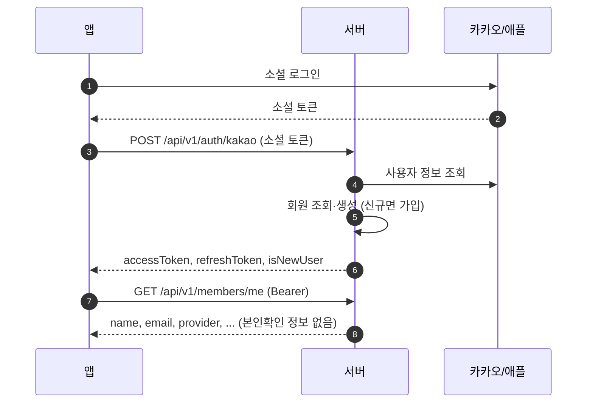
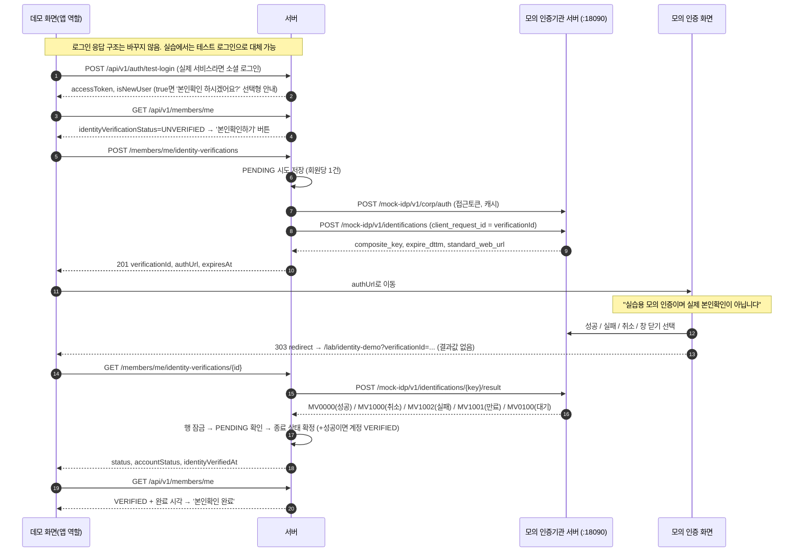
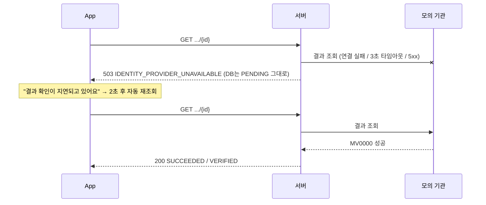
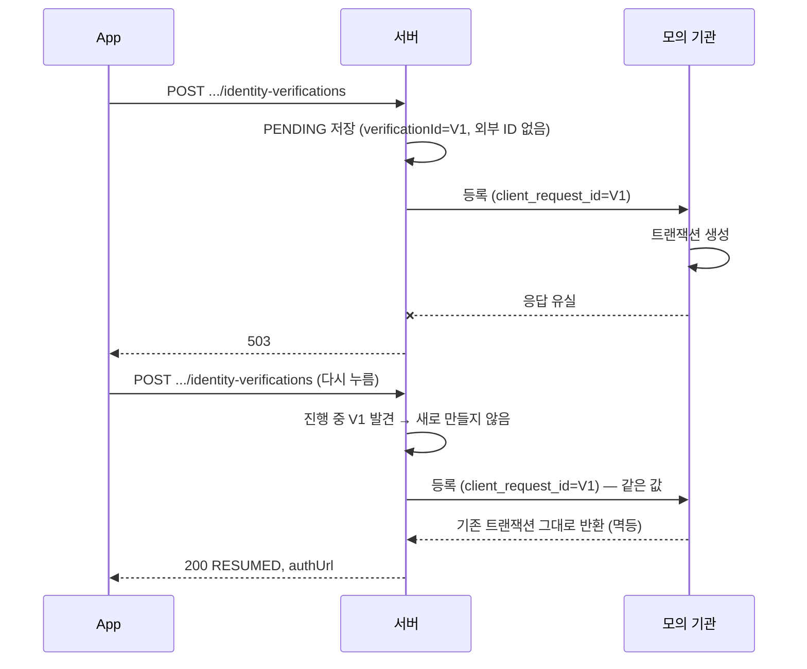
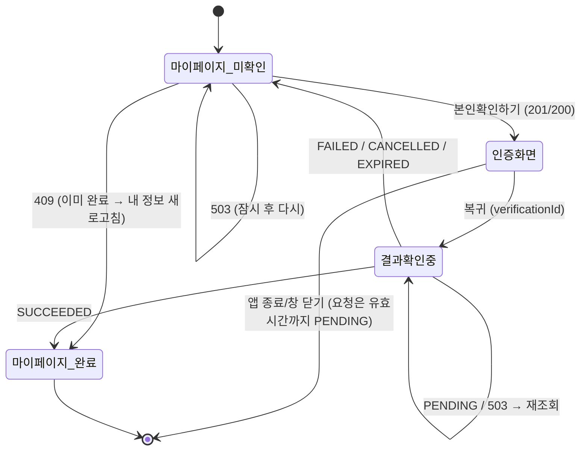

# 2. 흐름도

## 2.1 (참고) 출발점이 된 서비스의 가입·로그인 흐름

```mermaid
sequenceDiagram
    autonumber
    participant App as 앱
    participant S as 서버
    participant K as 카카오/애플
    App->>K: 소셜 로그인
    K-->>App: 소셜 토큰
    App->>S: POST /api/v1/auth/kakao (소셜 토큰)
    S->>K: 사용자 정보 조회
    S->>S: 회원 조회·생성 (신규면 가입)
    S-->>App: accessToken, refreshToken, isNewUser
    App->>S: GET /api/v1/members/me (Bearer)
    S-->>App: name, email, provider, ... (본인확인 정보 없음)
```

## 2.2 이 프로젝트: 로그인 흐름은 그대로, 마이페이지에 선택형 본인확인 추가

```mermaid
sequenceDiagram
    autonumber
    participant App as 데모 화면(앱 역할)
    participant S as 서버
    participant M as 모의 인증기관 서버 (:18090)
    participant W as 모의 인증 화면

    Note over App,S: 로그인 응답 구조는 바꾸지 않음. 실습에서는 테스트 로그인으로 대체 가능
    App->>S: POST /api/v1/auth/test-login (실제 서비스라면 소셜 로그인)
    S-->>App: accessToken, isNewUser (true면 '본인확인 하시겠어요?' 선택형 안내)
    App->>S: GET /api/v1/members/me
    S-->>App: identityVerificationStatus=UNVERIFIED → '본인확인하기' 버튼

    App->>S: POST /members/me/identity-verifications
    S->>S: PENDING 시도 저장 (회원당 1건)
    S->>M: POST /mock-idp/v1/corp/auth (접근토큰, 캐시)
    S->>M: POST /mock-idp/v1/identifications (client_request_id = verificationId)
    M-->>S: composite_key, expire_dttm, standard_web_url
    S-->>App: 201 verificationId, authUrl, expiresAt

    App->>W: authUrl로 이동
    Note over W: "실습용 모의 인증이며 실제 본인확인이 아닙니다"
    W->>M: 성공 / 실패 / 취소 / 창 닫기 선택
    W-->>App: 303 redirect → /lab/identity-demo?verificationId=... (결과값 없음)

    App->>S: GET /members/me/identity-verifications/{id}
    S->>M: POST /mock-idp/v1/identifications/{key}/result
    M-->>S: MV0000(성공) / MV1000(취소) / MV1002(실패) / MV1001(만료) / MV0100(대기)
    S->>S: 행 잠금 → PENDING 확인 → 종료 상태 확정 (+성공이면 계정 VERIFIED)
    S-->>App: status, accountStatus, identityVerifiedAt
    App->>S: GET /api/v1/members/me
    S-->>App: VERIFIED + 완료 시각 → '본인확인 완료'
```

## 2.3 예외 흐름: 외부 장애 → 재조회로 복구

```mermaid
sequenceDiagram
    participant App
    participant S as 서버
    participant M as 모의 기관
    App->>S: GET .../{id}
    S-xM: 결과 조회 (연결 실패 / 3초 타임아웃 / 5xx)
    S-->>App: 503 IDENTITY_PROVIDER_UNAVAILABLE (DB는 PENDING 그대로)
    Note over App: "결과 확인이 지연되고 있어요" → 2초 후 자동 재조회
    App->>S: GET .../{id}
    S->>M: 결과 조회
    M-->>S: MV0000 성공
    S-->>App: 200 SUCCEEDED / VERIFIED
```

## 2.4 예외 흐름: 등록 응답 유실

```mermaid
sequenceDiagram
    participant App
    participant S as 서버
    participant M as 모의 기관
    App->>S: POST .../identity-verifications
    S->>S: PENDING 저장 (verificationId=V1, 외부 ID 없음)
    S->>M: 등록 (client_request_id=V1)
    M->>M: 트랜잭션 생성
    M--xS: 응답 유실
    S-->>App: 503
    App->>S: POST .../identity-verifications (다시 누름)
    S->>S: 진행 중 V1 발견 → 새로 만들지 않음
    S->>M: 등록 (client_request_id=V1) — 같은 값
    M-->>S: 기존 트랜잭션 그대로 반환 (멱등)
    S-->>App: 200 RESUMED, authUrl
```

## 2.5 화면 상태 전이 (데모 화면 기준)

```mermaid
stateDiagram-v2
    [*] --> 마이페이지_미확인
    마이페이지_미확인 --> 인증화면: 본인확인하기 (201/200)
    마이페이지_미확인 --> 마이페이지_미확인: 503 (잠시 후 다시)
    마이페이지_미확인 --> 마이페이지_완료: 409 (이미 완료 → 내 정보 새로고침)
    인증화면 --> 결과확인중: 복귀 (verificationId)
    인증화면 --> [*]: 앱 종료/창 닫기 (요청은 유효시간까지 PENDING)
    결과확인중 --> 결과확인중: PENDING / 503 → 재조회
    결과확인중 --> 마이페이지_완료: SUCCEEDED
    결과확인중 --> 마이페이지_미확인: FAILED / CANCELLED / EXPIRED
    마이페이지_완료 --> [*]
```
